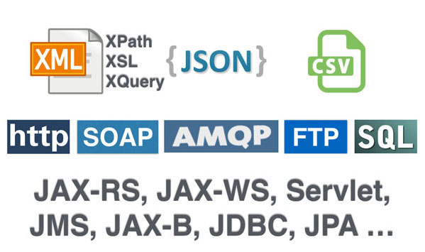
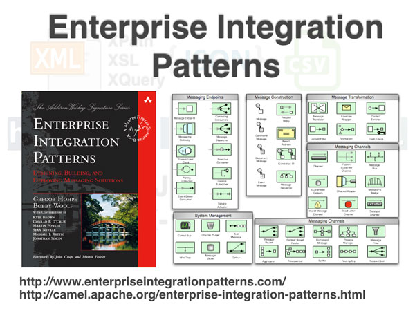
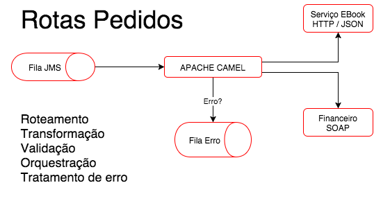

# alura-camel
Apache Camel

O que é um framework de integração?
O Apache Camel, como framework de integração, implementa a maioria dos padrões de integração. Um framework de integração ajuda a diminuir a complexidade e o impacto dessas integrações. Em vez de escrever código de integração na mão, usamos componentes para isso.

Com um framework de integração seguimos boas práticas que foram identificadas e amadurecidas ao longo do tempo. Apache Camel é o framework de integração mais famoso no mundo Java, mas não é a única opção. O Spring Integration é uma outra alternativa popular.
